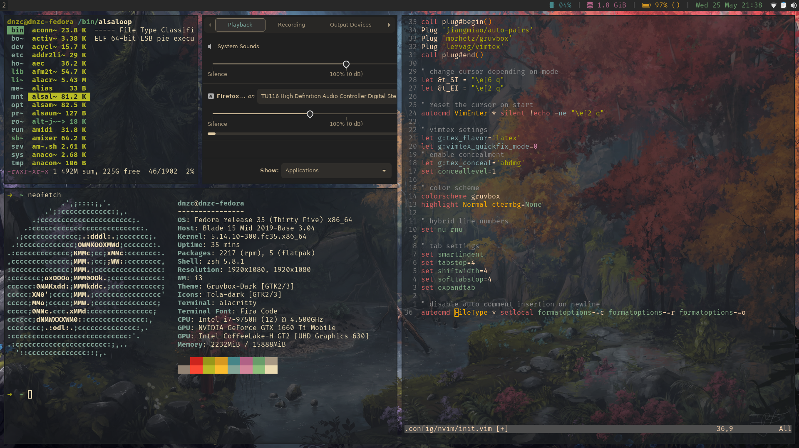

# dotfiles

Some of my linux config files, for aesthetic stuff. Gruvbox theme.

Distro: Fedora

WM: i3-gaps

Bar: i3status

Font: Fira Code + Font-Awesome

Terminal: Alacritty

Wallpaper: see [fantasynature.jpg](fantasynature.jpg)

Dots: see [.config/](.config/)
